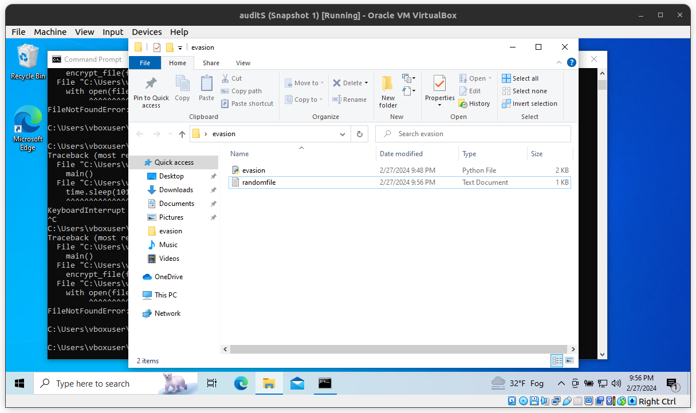
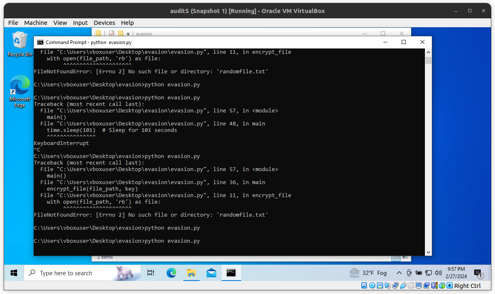

# Evasion

## Objective

The goal of this project is to understand the methods of hackers who bypass anti-viruses, so also to understand how antivirus works in a little more advanced way than mal-track.

## Overview

This project shows how to encrypt file content modify its size, perform an operation and then decrypt everything.
The evasion.py uses cryptography library to crypt the file and then decrypt with the same key. THe program increases
its size by appending null bytes. After 101 seconds the program then restores the original content.

## Pictures

# Questions

## How do Anti-Viruses Detect Viruses?

Anti-viruses employ several strategies to identify and neutralize viruses:

    Signature-Based Detection: Compares files against a database of known virus signatures, effectively identifying and blocking recognized threats.
    Heuristic Analysis: Uses algorithms to identify unknown viruses based on suspicious characteristics or patterns that deviate from normal, benign software behavior.
    Behavioral Analysis: Monitors software behavior in real-time, flagging activities typically associated with malicious operations, such as unauthorized file encryption or system modifications.
    Reputation and Anomaly Detection: Leverages a network-wide assessment of files and applications to gauge their trustworthiness, alongside detecting anomalies in system behavior that may indicate a security threat.

## How to Bypass Anti-Viruses?

Malicious actors employ various techniques to evade detection by anti-virus programs:

    Obfuscation and Polymorphism: Altering the code or encrypting the payload of a virus to make it unrecognizable to signature-based detection systems.
    Exploiting Zero-Day Vulnerabilities: Targeting vulnerabilities in software that are unknown to the software vendor and thus not yet covered by anti-virus updates.
    Living off the Land (LotL) Attacks: Utilizing built-in system tools and processes to carry out malicious activities, reducing the likelihood of detection since these tools are generally considered safe.
    Timing and Behavioral Evasion: Modifying the behavior of malware to delay execution or perform differently when it suspects it's being analyzed, thus avoiding detection by behavioral analysis techniques.
